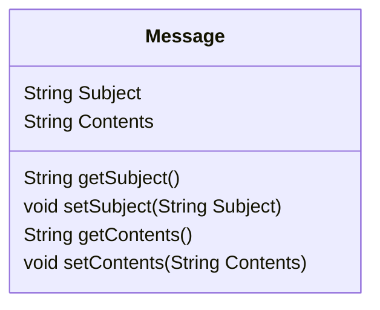

# Example

## Create Java class from HLA Interaction Class

The following HLA-FOM `Message.xml` shows a simple HLA Interaction Class called `Message`. The Interaction Class has just two parameters named `Subject` and `Contents`. Both parameters are of type HLAunicodeString.

```
<?xml version="1.0" encoding="UTF-8" standalone="yes"?>
<objectModel xsi:schemaLocation="http://standards.ieee.org/IEEE1516-2010 http://standards.ieee.org/downloads/1516/1516.2-2010/IEEE1516-DIF-2010.xsd" xmlns="http://standards.ieee.org/IEEE1516-2010" xmlns:xsi="http://www.w3.org/2001/XMLSchema-instance">
    <modelIdentification>
        <name>Message Module</name>
        <type>FOM</type>
        <version>1.0</version>
        <modificationDate>2017-12-14</modificationDate>
        <securityClassification>unclassified</securityClassification>
        <purpose>Send a message between federates</purpose>
        <applicationDomain>Simulation</applicationDomain>
        <description>Example</description>
        <useLimitation></useLimitation>
        <useHistory>v1.0 - First Version</useHistory>
        <poc>
            <pocType>Primary author</pocType>
            <pocName>John Doe</pocName>
            <pocOrg>TNO</pocOrg>
            <pocTelephone> </pocTelephone>
            <pocEmail> </pocEmail>
        </poc>
        <reference>
            <type>Text Document</type>
            <identification></identification>
        </reference>
        <other></other>
    </modelIdentification>
    <objects>
        <objectClass>
            <name>HLAobjectRoot</name>
        </objectClass>
    </objects>
    <interactions>
        <interactionClass>
            <name>HLAinteractionRoot</name>
            <interactionClass>
                <name>Message</name>
                <sharing>PublishSubscribe</sharing>
                <transportation>HLAreliable</transportation>
                <order>TimeStamp</order>
                <semantics>The message</semantics>
                <parameter>
                    <name>Subject</name>
                    <dataType>HLAunicodeString</dataType>
                    <semantics>The message subject.</semantics>
                </parameter>
                <parameter>
                    <name>Contents</name>
                    <dataType>HLAunicodeString</dataType>
                    <semantics>The message contents.</semantics>
                </parameter>
            </interactionClass>
        </interactionClass>
    </interactions>
    <switches>
        <autoProvide isEnabled="false"/>
        <conveyRegionDesignatorSets isEnabled="false"/>
        <conveyProducingFederate isEnabled="false"/>
        <attributeScopeAdvisory isEnabled="false"/>
        <attributeRelevanceAdvisory isEnabled="false"/>
        <objectClassRelevanceAdvisory isEnabled="false"/>
        <interactionRelevanceAdvisory isEnabled="false"/>
        <serviceReporting isEnabled="false"/>
        <exceptionReporting isEnabled="false"/>
        <delaySubscriptionEvaluation isEnabled="false"/>
        <automaticResignAction resignAction="CancelThenDeleteThenDivest"/>
    </switches>
    <dataTypes>
        <basicDataRepresentations/>
        <simpleDataTypes />
        <enumeratedDataTypes />
        <arrayDataTypes />
        <fixedRecordDataTypes />
        <variantRecordDataTypes />
    </dataTypes>
    <notes/>
</objectModel>
```

The corresponding Java class for the HLA Interaction Class `Message` is shown below.



As can be seen this Java class is a Java Bean. Each Java class property name matches with the parameter name. Also the Java type matches with the parameter datatype. A public getter and setter is defined to access the class property.

```
package helloworld;

public class Message {

    String Subject;
    String Contents;

    public String getSubject() {
        return this.Subject;
    }

    public void setSubject(String Subject) {
        this.Subject = Subject;
    }

    public String getContents() {
        return this.Contents;
    }

    public void setContents(String Contents) {
        this.Contents = Contents;
    }
}
```

## Create application using Java Message class

The following example shows a simple federate application that sends and receives messages. The federate application can be instantiated as much as needed.

```
package nl.tno.oorti.test.example.helloworld;

import hla.rti1516e.*;
import hla.rti1516e.exceptions.*;
import java.net.URL;
import java.util.Set;
import nl.tno.oorti.NullOOFederateAmbassador;
import nl.tno.oorti.OORTIambassador;
import nl.tno.oorti.OORTIfactory;
import nl.tno.oorti.OOparameter;

public class HelloWorld extends NullOOFederateAmbassador {

	public void demo() throws RTIexception {
		// create the OORTI Ambassador
		OORTIambassador rtiamb = new OORTIfactory().getRtiAmbassador();

		// connect to the RTI in evoked mode
		rtiamb.connect(this, CallbackModel.HLA_EVOKED);

		// setup module URL
		URL[] modules = new URL[]{this.getClass().getResource("/foms/Message.xml")};

		// Attempt to create a new federation
		try {
			rtiamb.createFederationExecution("federationName", modules);
		} catch (FederationExecutionAlreadyExists ex) {
		}

		// join the federation execution
		rtiamb.joinFederationExecution("federateType", "federationName", modules);

		// publish and subscribe to the class of interest
		rtiamb.publishInteractionClass(Message.class);
		rtiamb.subscribeInteractionClass(Message.class);

		// send and receive a message a few times
		for (int i = 0; i < 60; i++) {
			Message msg = new Message();
			msg.setContents("Message" + i);
			rtiamb.sendInteraction(msg, null);
			System.out.println("Sent: " + msg.getContents());
			rtiamb.evokeCallback(1);
		}

		// resign and disconnect
		rtiamb.resignFederationExecution(ResignAction.NO_ACTION);
		rtiamb.disconnect();
	}

	@Override
	public void receiveInteraction(
			Object theInteraction,
			Set<OOparameter> theParameters,
			byte[] userSuppliedTag,
			OrderType sentOrdering,
			TransportationTypeHandle theTransport,
			SupplementalReceiveInfo receiveInfo)
			throws FederateInternalError {
		// print the message received
		Message theMessage = (Message) theInteraction;
		System.out.println("Received: " + theMessage.getContents());
	}

	public static void main(String[] args) throws RTIexception {
		new HelloWorld().demo();
	}
}
```
