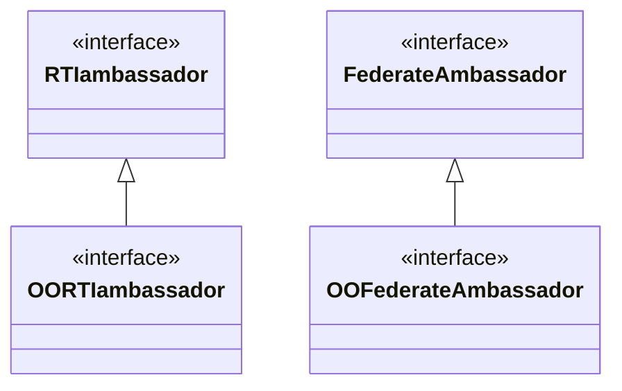

# Overview
The **Object Oriented RTI** (OORTI) extends the HLA-RTI interface with methods to work with **Java Beans**. Java Beans are automatically encoded or decoded on behalf of the federate application. This approach simplifies data marshalling in the federate application. And in addition, since the HLA-RTI interface is extended with additional methods, the current RTI interface methods remain available as well.

The OORTI extensions concern both the **RTIambassador** interface and the **FederateAmbassador** interface. Methods are added to these interfaces to handle:

- the publication and subscription of Java classes (as HLA Object Classes and HLA Interaction Classes);
- the registration, removal and updating of Java objects (as HLA Objects);
- the transmission of Java objects (as HLA Interactions).

The interface extensions are illustrated in the class diagram below.

Java objects are automatically encoded/decoded conform the HLA-OMT 2010.2 standard. Encoding and decoding of Java objects is done with the Java reflection API.

If a **Java class** is published/subscribed then the **OORTIambassador**

- Introspects the Java class structure and verifies that the class construction rules are followed.
- Prepares internal class administration for the encoding/decoding Java object properties.

If a **Java object** is provided then the **OORTIambassador** or **OOFederateAmbassador**:

- Gets/sets and encodes/decodes the Java object property values based on the previously created internal class administration, using the Java reflection API.

The FOM is used amongst others for Java class structure verification and for field identification/ordering in FOM fixed or variant record types. There are several methods to access Java object property values via the Java reflection API. The OORTI supports several methods, including fast access via the Java _LambdaMetafactory_.
